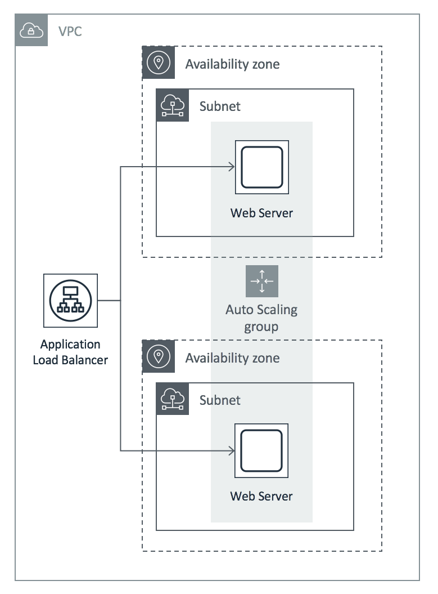
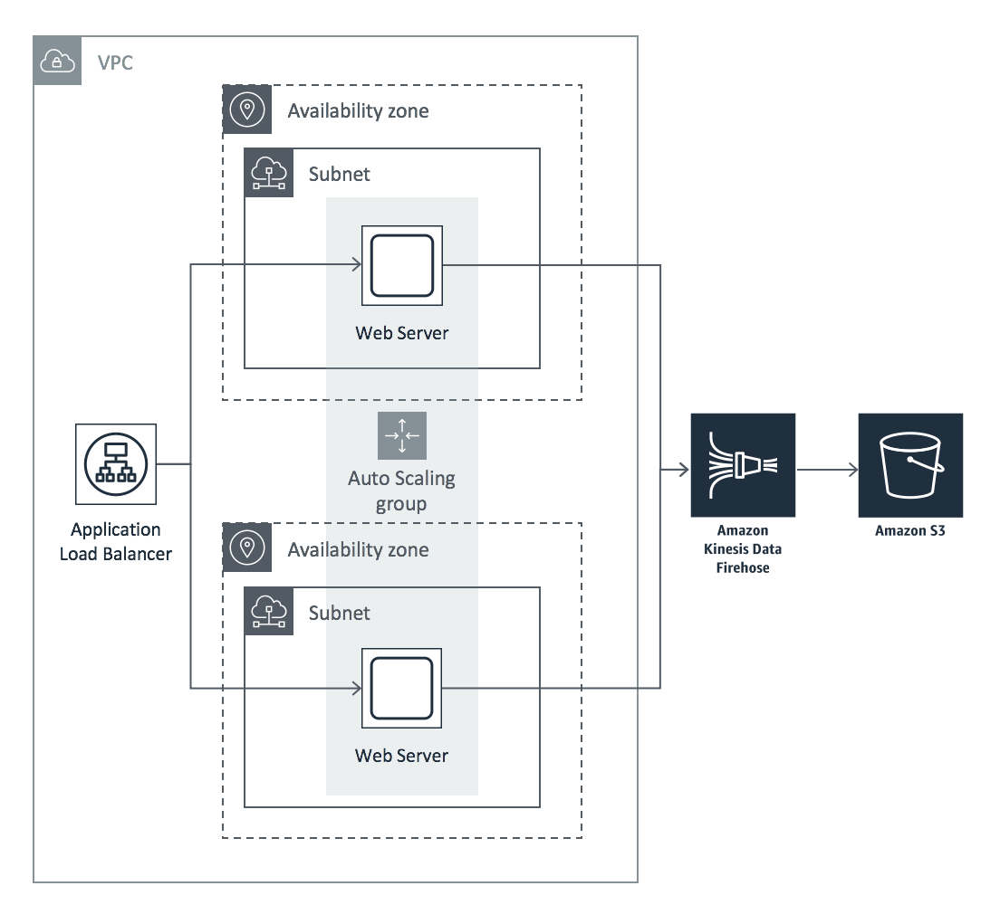

# AWS Realtime Web Analytics Workshop

## Introduction

Knowing what users are doing on your web sites in realtime gives you insights you can act on without having to wait for delayed batch processing of clickstream data.  There are many use cases for evaluating web traffic analytics in realtime.  Watching the immediate impact to user behavior after new releases, detecting and responding to anomalies, situational awareness, and evaluating trends are all benefits of having realtime web site analytics.

In this workshop we will build a cost optimized platform to capture web beacon traffic, analyze the traffic for interesting metrics, and display it on a customized dashboard.

## Module 1 – Capturing Realtime Clickstream Events from Web Servers

In this module, you will start with an AutoScaling Group of Apache web servers, representing the front-end of your existing website or application.  The AutoScaling Group receives incoming connections from an Application Load Balancer, and is configured to automatically scale out (and back in) based on the amount of incoming network traffic received by the web servers:

You will then create an S3 analytics bucket that will store an archive of all the clickstream events for historical analysis, and create a Kinesis Firehose delivery stream that will deliver messages to the S3 analytics bucket.  You'll add a Kinesis agent to the fleet of web servers and configure it to send messages that appear in the Apache access logs to the Kinesis Firehose delivery stream: 

In this scenario, you will leverage Amazon S3, Amazon EC2 Linux Instances, AutoScaling, Amazon Kinesis Data Firehose, and CloudFormation to automate the initial deployment, as well as changes to the stack.

[Get Started on Module 1](module-1/README.md)

## Module 2 – Performing Realtime Analytics with Kinesis Analytics

Lorem ipsum...

[Get started on module 2](module-2/README.md)

## Module 3 - Adding Custom Metrics and Extending the Solution

Lorem ipsum...

[Get started on module 3](module-3/README.md)

## License

Copyright 2018 Amazon.com, Inc. or its affiliates. All Rights Reserved.

Licensed under the Apache License, Version 2.0 (the "License"). You may not use this file except in compliance with the License. A copy of the License is located at

http://aws.amazon.com/apache2.0/

or in the "license" file accompanying this file. This file is distributed on an "AS IS" BASIS, WITHOUT WARRANTIES OR CONDITIONS OF ANY KIND, either express or implied. See the License for the specific language governing permissions and limitations under the License.
