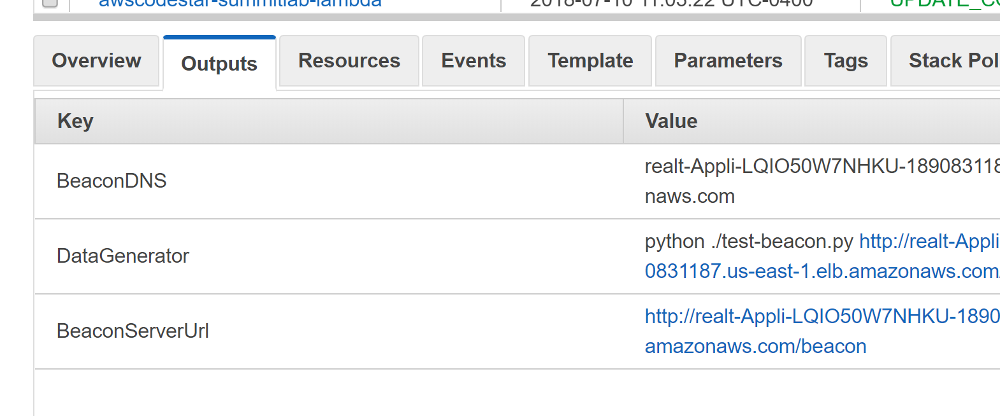

#  Configure Kinesis Analytics to process clickstream data and add a Lambda function to save processed items in DynamoDB

## Introduction

In this module, you will use the CloudFormation template to update your solution to include a Kinesis Analytics application, Lambda function and two DynamoDB talbes.  You will then start the Kinesis Analytics application, update the SQL, add a destination, and connect the destination to the Lambda function.  

## Architecture Overview


## 1. Deploy Processing Pipeline Components

If you have already completed module #1, you can update the existing stack with the starting point for module #2 following steps in 1.A.  Otherwise if you skipped the first module, you can create a new stack with the starting point for module #2 by following the instructions in 1.B. 

<details>
<summary><strong>1.A CloudFormation Update Stack Instructions (expand for details)</strong></summary><p>

1.	Navigate to the CloudFormation serviice in the AWS Console.
2.  Check the box for the stack you created in module #1.


3.  Click Actions and Update Stack from the menu.


4.  Click Choose File and select the 2-kinesis-analytics-module-start.yaml from your local module-2 folder cloned from this git repository.


5.  Click **Next**.
6.  Click **Next**.
7.  Check the box indicating acknowledgement that the stack will create IAM Roles.


8.  Click the **Update** button in the lower right.

</p></details>

<p>
Skip the next section if you have just completed 1.A.
</p>

<details>
<summary><strong>1.B Alternative: If you skipped Module 1 you can start with Module 2 (expand for details)</strong></summary><p>

If you already deployed a stack from Module 1, **skip this section**.
Otherwise, you can start by launching the Module 2 starting template.  

1.	Right click the **Launch Stack** link below and "open in new tab"

Region| Launch
------|-----
US West (Oregon) | [](https://console.aws.amazon.com/cloudformation/home?region=us-west-2#/stacks/new?stackName=realtime-analytics-workshop&templateURL=https://s3-us-west-2.amazonaws.com/realtime-analytics-workshop/2-kinesis-analytics-module-start.yaml)
US West (N. Virginia) | [](https://console.aws.amazon.com/cloudformation/home?region=us-east-1#/stacks/new?stackName=realtime-analytics-workshop&templateURL=https://s3-us-west-2.amazonaws.com/realtime-analytics-workshop/2-kinesis-analytics-module-start.yaml)

2.	Click **Next** on the Select Template page.
3.	**(Optional)** If you'd like to login to the web servers, select an **SSH Keypair** for this region, select True next to **Enable SSH**, and enter a CIDR block such as `0.0.0.0/0` next to **Enable SSH From**. If you don't have a key pair already created, see ([Creating a key pair using amazon EC2](http://docs.aws.amazon.com/AWSEC2/latest/UserGuide/ec2-key-pairs.html#having-ec2-create-your-key-pair))


4.	Click **Next**.
5.	Click **Next** Again. (skipping IAM advanced section)
6.	On the Review page, check the box to acknowledge that CloudFormation will create IAM resources and click **Create**.


7. While you wait for the CloudFormation stack to be created, download the CloudFormation template by right-clicking here and selecting **Save Link As...**: ([Module 2 Starting Template](https://s3-us-west-2.amazonaws.com/realtime-analytics-workshop/2-kinesis-analyytics-module-start.yaml))
8. Open the template you just downloaded in a text editor.  If you don't have a text editor, you can download a trial of Sublime Text here: ([Sublime Text](https://www.sublimetext.com))

When you see the stack showing a **CREATE_COMPLETE** status, you are ready to move on to the next step.

</p></details>

Your stack will take a few minutes to deploy.  When the status for the stack changes to UPDATE_COMPLETE or CREATE_COMPLETE you can proceed to the next section. 

## 2. Generating Random Web Traffic for Processing

In this section you will execute a python script that posts http header data to your front end web servers.  To make it easy we added an output variable in the stack that contains the command line needed to generate web traffic sent to your ELB.  

<details>
<summary><strong>Execute the python script to simulate web traffic. (expand for details)</strong></summary><p>

1.  In the AWS Console select CloudFormation to view the Stacks and check the box to the left of your stack that you just updated. 


2.  Select the Outputs tab to display the output variables for your stack. 
3.  Locate the DataGenerator key and copy the Value from the browser.  



<details>
<summary><strong>Example Command (expand for details)</strong></summary>

```bash
	python ./test-beacon.py http://realt-Appli-1P8C8FJ52YGXM-EXAMPLE.us-east-1.elb.amazonaws.com/beacon 20000 0.5
```

*  The first parameter is the address for the load balancer.  Your DNS entry will be different than the example here.
*  The second parameter is the number of requests to send before ending the script.  In this case the script will simulate 20,000 web requests.
*  The last parameter is the number of seconds to delay between sending requests.  Using these values the script should generate data for over two hours. 
4.  Open a terminal or command window, naviagte to the folder that contains the test-beacon.py script and execute the command.  If the post messages are sent successfully to the load balancer, you should see an incrementing count in the terminal window.  You can leave this running for the rest of the workshop. 

</details>

</details>

## 3. Manually Updating the Kinesis Analytics Application in the Console 

In this step we are going to manually add the SQL and destination stream in Kinesis Analytics through the console.  This is to allow you to get familiaar with Kinesis Analyitics and see the effects of modifying SQL and inspecting the in application streams.  

<details>
<summary><strong>Update the SQL (expand for details)</strong></summary><p>

1.  Select the Kinesis service in the AWS Console.
2.  Locate the Kinesis analytics applications list you created through CloudFormation which will be prepended with your stack name.  By default it will be named realtime-analytics-workshop-WebMetricsApplication.
3.  Click the application name to display the details for the application.
4.  Notice that the source is the Firehose delivery stream created earlier.
5.  Click on the Go to SQL editor button to open the editor.


6.  Click Yes, start application to start processing incoming data.


7.  In the SQL Editor we will be creating a new stream to collect the output of the other streams and be used as the single output stream for the application. The stream will be named DESTINATION_SQL_STREAM and contain the following columns:
    *   MetricType VARCHAR(16),
    *   EventTimestamp BIGINT,
    *   MetricItem VARCHAR(1024),
    *   UnitValueInt BIGINT,
    *   UnitValueFloat DOUBLE 

<summary><strong>Create In-Application Destination Stream (expand for code)</strong></summary>
Add the following code to the SQL editor

```SQL
CREATE STREAM "DESTINATION_SQL_STREAM"(
    MetricType VARCHAR(16),
    EventTimestamp BIGINT,
    MetricItem VARCHAR(1024),
    UnitValueInt BIGINT,
    UnitValueFloat DOUBLE);
```
</details>

8.  Click **Save and run SQL**
9.  After several seconds the analytics application will start processing the incoming data.  Select the DESTINATION_SQL_STREAM on the Real-time analytics tab and notice data records flowing through.  
10. Click the Close link below the data table to return to the Kinesis application pipeline components.  
11. Click the **Connect to a destination** button. 
12. Select AWS Lambda function for the Destination and select the metric processing function created by the module 2 CloudFormation template.  It will be named <strong>stack-name</strong>ProcessMetricsFunction.  Make sure you are **not** selecting the custom helper function.  


13. Select Choose an existing in-application stream, select the DESTINATION_SQL_STREAM that you just created, and select JSON for the Output format.


14. Re-Select the role named <strong>stack-name</strong>KinesisAnalyticsRole to enable the Save and continue button the click the button.


### Start next module

Module 3: [Creating a CloudWatch Dashboard](../module-3/README.md)

## License

Copyright 2018 Amazon.com, Inc. or its affiliates. All Rights Reserved.

Licensed under the Apache License, Version 2.0 (the "License"). You may not use this file except in compliance with the License. A copy of the License is located at

http://aws.amazon.com/apache2.0/

or in the "license" file accompanying this file. This file is distributed on an "AS IS" BASIS, WITHOUT WARRANTIES OR CONDITIONS OF ANY KIND, either express or implied. See the License for the specific language governing permissions and limitations under the License.

[Back to the main workshop page](../README.md)
