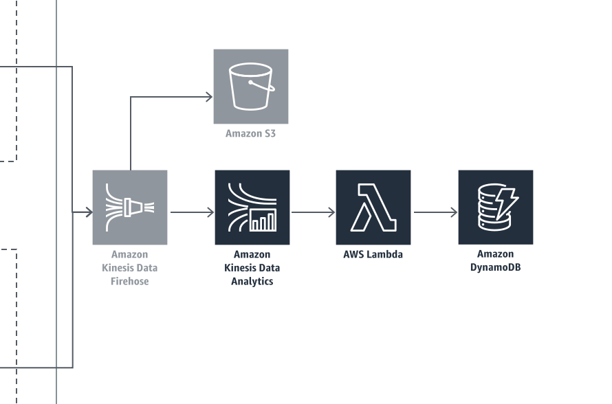
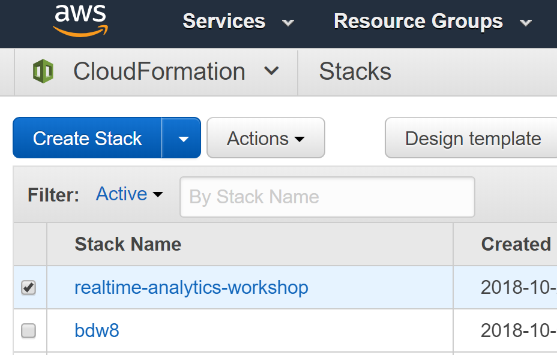
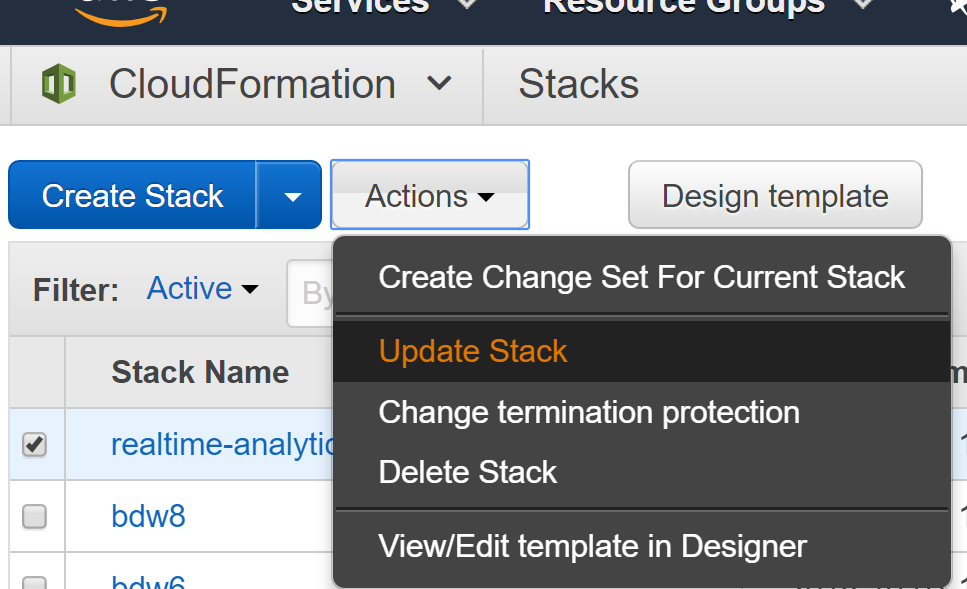
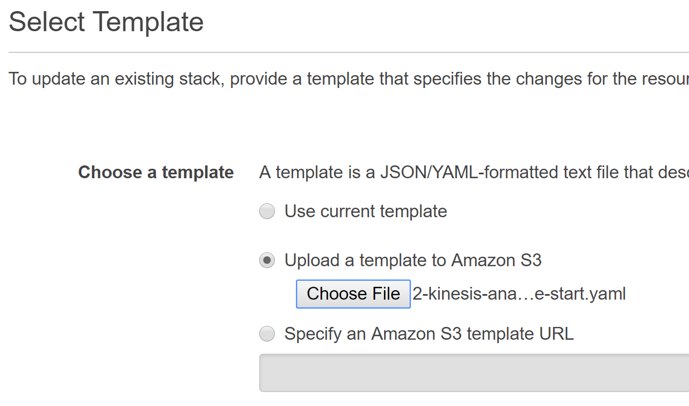
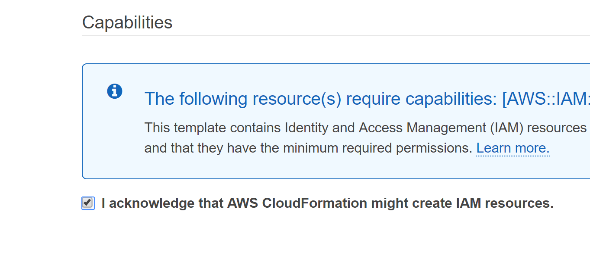
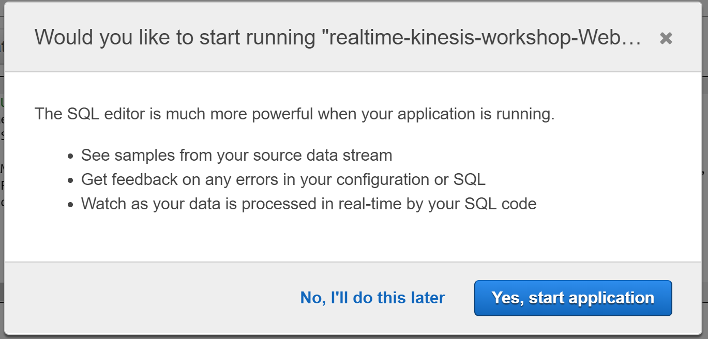
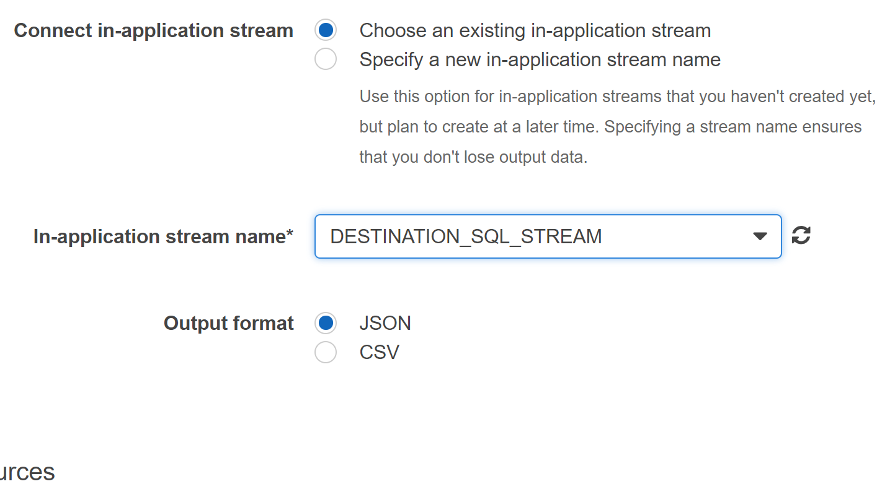
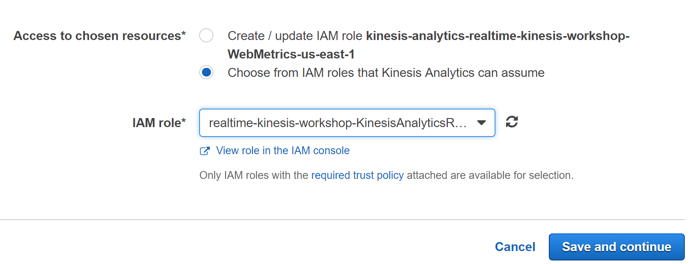

#  Configure Kinesis Analytics to Process Clickstream Data

## Introduction

In this module, you will use CloudFormation to add a Kinesis Analytics application, Lambda function and two DynamoDB talbes.  You will then start the Kinesis Analytics application, update the SQL, add a destination, and connect the destination to the Lambda function.  

## Architecture Overview of Module #2 Components



## 1. Deploy Processing Pipeline Components

If you have already completed module #1, you can update the existing stack with the starting point for module #2 following steps in 1.A.  Otherwise if you skipped the first module, you can create a new stack with the starting point for module #2 by following the instructions in 1.B. 

<details>
<summary><strong>1.A Update CloudFormation Stack from Module #1 (expand for details)</strong></summary><p>

1.	Navigate to the CloudFormation serviice in the AWS Console.
2.  Check the box for the stack you created in module #1.



3.  Click Actions and Update Stack from the menu.



4.  Click Choose File and select the 2-kinesis-analytics-module-start.yaml from your local module-2 folder cloned from this git repository.



5.  Click **Next**.
6.  Click **Next**.
7.  Check the box indicating acknowledgement that the stack will create IAM Roles.



8.  Click the **Update** button in the lower right.

</p></details>

<p>  

Skip 1.B the if you have completed 1.A.  

</p>  


<details>
<summary><strong>1.B Alternative: If you skipped Module #1 you can start with Module #2 (expand for details)</strong></summary><p>  

<p>  

If you sucessfully completed Module 1, **skip this section**. Otherwise, you can start by launching the Module 2 starting template.  

</p>  


1.	Right click the **Launch Stack** link below and "open in new tab"

Region| Launch
------|-----
US West (Oregon) | [](https://console.aws.amazon.com/cloudformation/home?region=us-west-2#/stacks/new?stackName=realtime-analytics-workshop&templateURL=https://s3-us-west-2.amazonaws.com/realtime-analytics-workshop/2-kinesis-analytics-module-start.yaml)
US West (N. Virginia) | [](https://console.aws.amazon.com/cloudformation/home?region=us-east-1#/stacks/new?stackName=realtime-analytics-workshop&templateURL=https://s3-us-west-2.amazonaws.com/realtime-analytics-workshop/2-kinesis-analytics-module-start.yaml)

2.	Click **Next** on the Select Template page.
3.	**(Optional)** If you'd like to login to the web servers, select an **SSH Keypair** for this region, select True next to **Enable SSH**, and enter a CIDR block such as `0.0.0.0/0` next to **Enable SSH From**. If you don't have a key pair already created, see ([Creating a key pair using amazon EC2](http://docs.aws.amazon.com/AWSEC2/latest/UserGuide/ec2-key-pairs.html#having-ec2-create-your-key-pair))


4.	Click **Next**.
5.	Click **Next** Again. (skipping IAM advanced section)
6.	On the Review page, check the box to acknowledge that CloudFormation will create IAM resources and click **Create**.


When you see the stack showing a **CREATE_COMPLETE** status, you are ready to move on to the next step.

</p></details>  

Your stack will take a few minutes to deploy.  When the status for the stack changes to UPDATE_COMPLETE or CREATE_COMPLETE you can proceed to the next section.

## 2. Manually Updating the Kinesis Analytics Application in the Console 

In this step we are going to manually add the SQL and destination stream in Kinesis Analytics through the console.  This is to allow you to get familiaar with Kinesis Analyitics and see the effects of modifying SQL and inspecting the in application streams.  

<details>
<summary><strong>Update the SQL (expand for details)</strong></summary><p>

1.  Select the Kinesis service in the AWS Console.
2.  Locate the Kinesis analytics applications list you created through CloudFormation which will be prepended with your stack name.  By default it will be named realtime-analytics-workshop-WebMetricsApplication.
3.  Click the application name to display the details for the application.
4.  Notice that the source is the Firehose delivery stream created earlier.
5.  Click on the **Go to SQL editor** button to open the editor.


6.  Click **Yes, start application** to start processing incoming data.



7.  In the SQL editor you will be creating a new stream to collect the output of the other streams and it be used as the output stream for the application. The stream will be named DESTINATION_SQL_STREAM and contain the following columns:
    *   MetricType VARCHAR(16),
    *   EventTimestamp BIGINT,
    *   MetricItem VARCHAR(1024),
    *   UnitValueInt BIGINT,
    *   UnitValueFloat DOUBLE 

</details>

<details>
<summary><strong>Create In-Application Destination Stream (expand for code)</strong></summary>
Add the following code to the SQL editor

```SQL
CREATE STREAM "DESTINATION_SQL_STREAM"(
    MetricType VARCHAR(16),
    EventTimestamp BIGINT,
    MetricItem VARCHAR(1024),
    UnitValueInt BIGINT,
    UnitValueFloat DOUBLE);
```

8.  Click **Save and run SQL**
</details>

<details>
<summary><strong>Configure the Application Output (expand for details) </strong></summary><p>

1.  After several seconds the analytics application will start processing the incoming data.  Select the DESTINATION_SQL_STREAM on the Real-time analytics tab and notice data records flowing through.  
2. Click the Close link below the data table to return to the Kinesis application pipeline components.  
3. Click the **Connect to a destination** button. 
4. Select AWS Lambda function for the Destination and select the metric processing function created by the module 2 CloudFormation template.  It will be named <strong>stack-name</strong>-ProcessMetricsFunction.  Make sure you are **not** selecting the custom helper function.  


5. Select Choose an existing in-application stream, select the DESTINATION_SQL_STREAM that you just created, and select JSON for the Output format.



6. Re-Select the role named <strong>stack-name</strong>-KinesisAnalyticsRole to enable the Save and continue button the click the button.



</details>  

<details>
<summary><strong>Review Completed Steps (expand for details) </strong></summary><p>  


You should now have data flowing through the pipeline into the **stack-name**-MetricDetails DynnamoDB table.  

  

</details>  

Note: The template **2-kinesis-analytics-module-completed.yaml** contains the changes that were manually completed in this module.  If you update the stack with this template, the Kinesis Data Application will not be started.  After updating the template go to Kinesis and start the WebMetricsApplication manually. The custom resource helper also has a function to start the application manually but it has not been included in this workshop. 

### Start next module

Module 3: [Visualizing Metrics using CloudWatch Dashboards](../module-3/README.md)

## License Summary

Copyright 2018 Amazon.com, Inc. or its affiliates. All Rights Reserved.

This sample code is made available under a modified MIT license. See the LICENSE file.

[Back to the main workshop page](../README.md)
