#  Visualizing Metrics using CloudWatch Dashboards

## Introduction

In this module, which builds on our previous modules, you will start with realtime metric data that is being inserted into a DynamoDB table by our Kinesis Data Analytics application.  You'll learn how to capture the table activity with [DynamoDB Streams](https://docs.aws.amazon.com/amazondynamodb/latest/developerguide/Streams.html).  Once the stream has been created, you'll create a Lambda function that subscribes to the DynamoDB stream and processes the data change events, publishing them as [CloudWatch Metrics](https://docs.aws.amazon.com/AmazonCloudWatch/latest/monitoring/working_with_metrics.html) using [PutMetricData](https://docs.aws.amazon.com/AmazonCloudWatch/latest/APIReference/API_PutMetricData.html).  Finally, after the CloudWatch Metrics are published, we'll visualize the data by creating a [CloudWatch Dashboard](https://docs.aws.amazon.com/AmazonCloudWatch/latest/monitoring/CloudWatch_Dashboards.html). 

## Architecture Overview

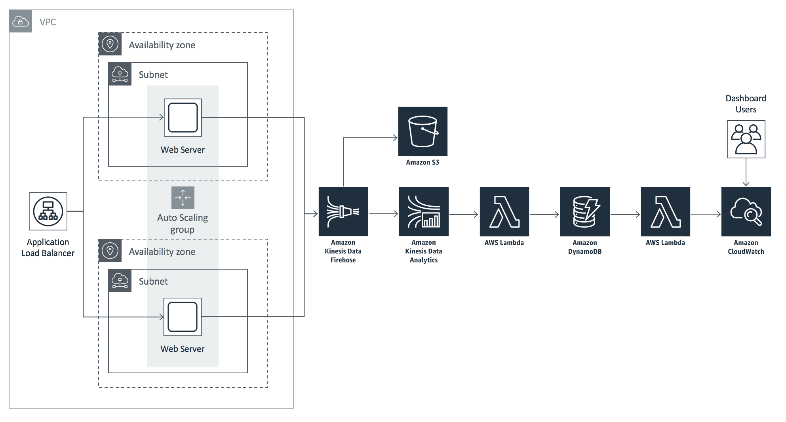

## 1. Create a DynamoDB Stream

First, we need to create a DynamoDB Stream from the `realtime-analytics-MetricDetails` DynamoDB table.

<details>
<summary><strong>DynamoDB Stream creation (expand for details)</strong></summary>

1.  Open the AWS console in a web browser and navigate to **Services**, **DynamoDB**.  Select the `realtime-analytics-MetricDetails` table, then look at the **Overview** tab on the right.  Under **Stream details**, click the button that says **Manage Stream**:

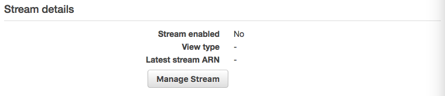

2.  Select **New image** under **View type**, then click the **Enable** button:

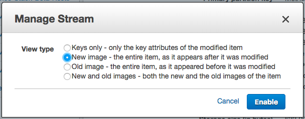

3. If everything worked successfully, you should see a value next to **Latest stream ARN** in **Stream details**.

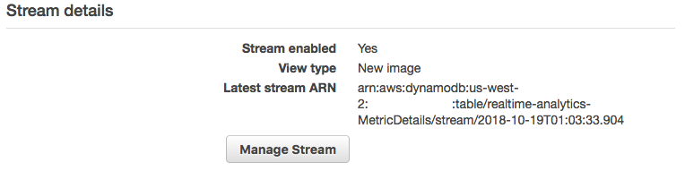

</details>

## 2. Create an IAM role and policy for DynamoDB Streams, Lambda, and CloudWatch

Next, we need to create an IAM role and policy that will be used by the Lambda function, and will enable the DynamoDB Stream to invoke the Lambda function, and will allow the Lambda function to publish metric data to CloudWatch.

<details>
<summary><strong>IAM role and policy creation (expand for details)</strong></summary><p>

1.  Open the AWS console, and navigate to **Services**, **IAM**.
2.  Click on **Roles** on the left column, the click the **Create role** button.
3.  On the **Create role** screen, select **AWS service**, then choose the **Lambda** service, and click the button labeled **Next: Permission**:

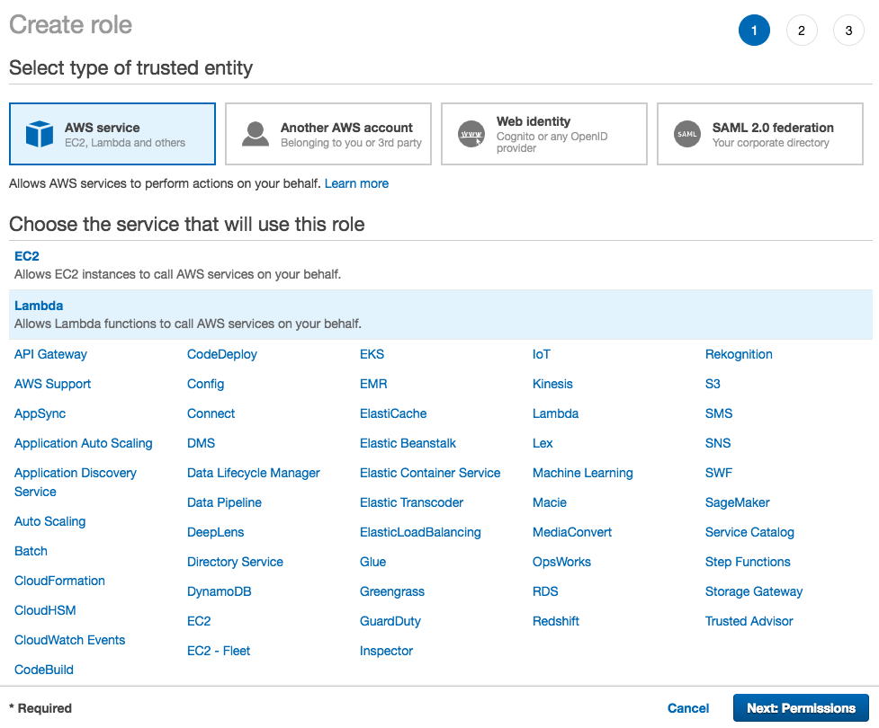

4.  On the next screen, click the **Create policy** button, which will open the IAM policy editor in a new tab:

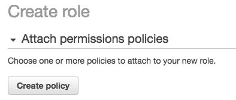

5.  On the **Create policy** screen, select the **JSON** tab at the top, then select all text and clear the editor window:

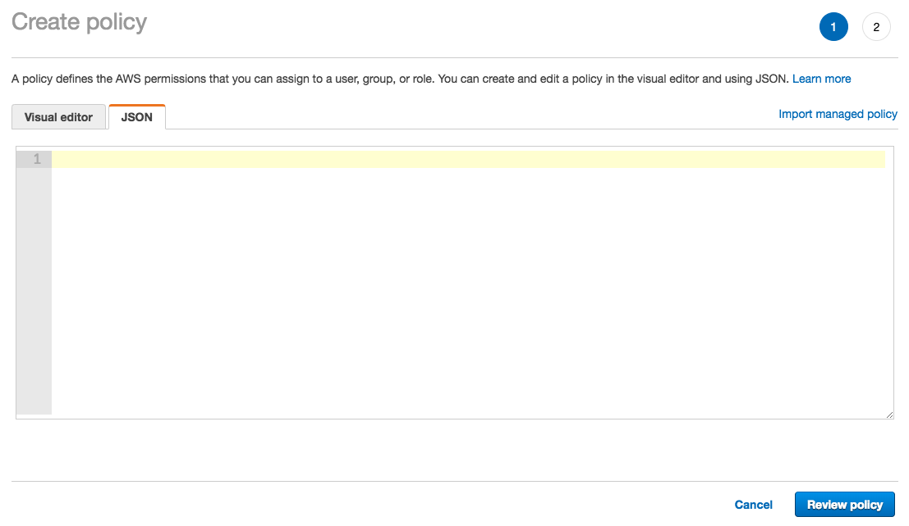

6.  Edit the following policy in a text editor, replacing `<Region>` with the AWS region name you are deploying to, such as `us-west-2`.  Next, replace `<Account ID>` with your 12-digit AWS account ID.  This account ID can be found by clicking your AWS username in the top right of the console:

```JSON
{
    "Version": "2012-10-17",
    "Statement": [
        {
            "Effect": "Allow",
            "Action": "lambda:InvokeFunction",
            "Resource": "arn:aws:lambda:<Region>:<Account ID>:function:pushMetrics*"
        },
        {
            "Effect": "Allow",
            "Action": [
                "logs:CreateLogGroup",
                "logs:CreateLogStream",
                "logs:PutLogEvents"
            ],
            "Resource": "arn:aws:logs:<Region>:<Account ID>:*"
        },
        {
            "Effect": "Allow",
            "Action": [
                "dynamodb:DescribeStream",
                "dynamodb:GetRecords",
                "dynamodb:GetShardIterator",
                "dynamodb:ListStreams"
            ],
            "Resource": "arn:aws:dynamodb:<Region>:<Account ID>:table/realtime-analytics-MetricDetails/stream/*"
        },
        {
            "Effect": "Allow",
            "Action": [
                "cloudwatch:PutMetricData"
            ],
            "Resource": [
                "*"
            ]
        }
    ]
}
```

7.  Copy and paste the policy you just edited into the **Create policy** inline editor.  Click the **Next** button.  Verify the Policy Summary looks correct on the **Review policy** screen.  Give the policy a name like `DynamoDB-Streams-Lambda-CloudWatch` or similar, then click the **Create policy** button:

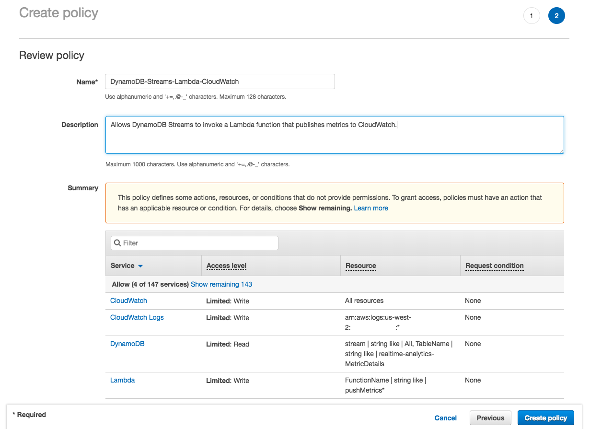

8.  Switch back to the **Create role** tab of your browser, and select the policy you just created by checking the box next to it.  Click **Next: Review**.  **Note:** you might need to click the Refresh button that looks like a pair of circular arrows on the top right of this screen in order to see the policy you just created:

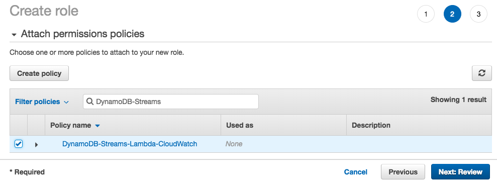

9.  Finally, give the role a name like `DDB-Streams-Lambda-Role` and click the **Create role** button:

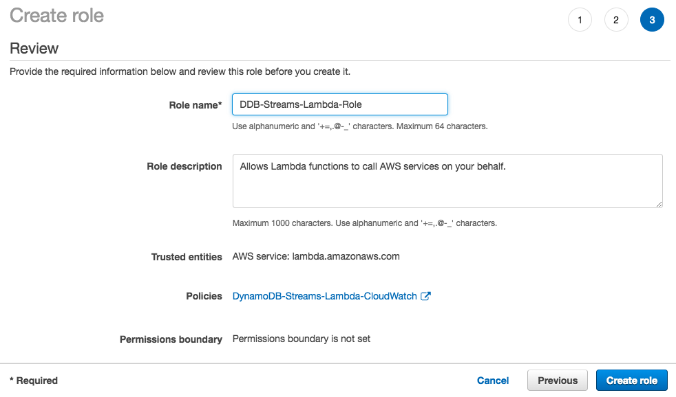

10.  You should see confirmation that the role has been created:

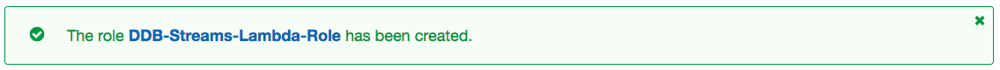

</p></details>

## 3. Create the PushMetrics Lambda Function

In this step, we'll create the Lambda function that publishes CloudWatch metrics data from the DynamoDB Stream.

<details>
<summary><strong>Lambda Function creation (expand for details)</strong></summary><p>

1.  Open the AWS console, then navigate to **Services**, **Lambda**, and click the **Create function** button in the top right of the console.
2.  On the **Create function** screen, **Author from scratch** should already be selected, if not select it, and give your function the name `pushMetrics` (this must match the function name in the IAM policy you just created).  Select `Python 2.7` in the **Runtime** field, then select `Choose an existing role` from the drop-down menu under **Role**.  Finally, choose the role you just created from the drop-down menu under **Existing role**, and click the **Create function** button:

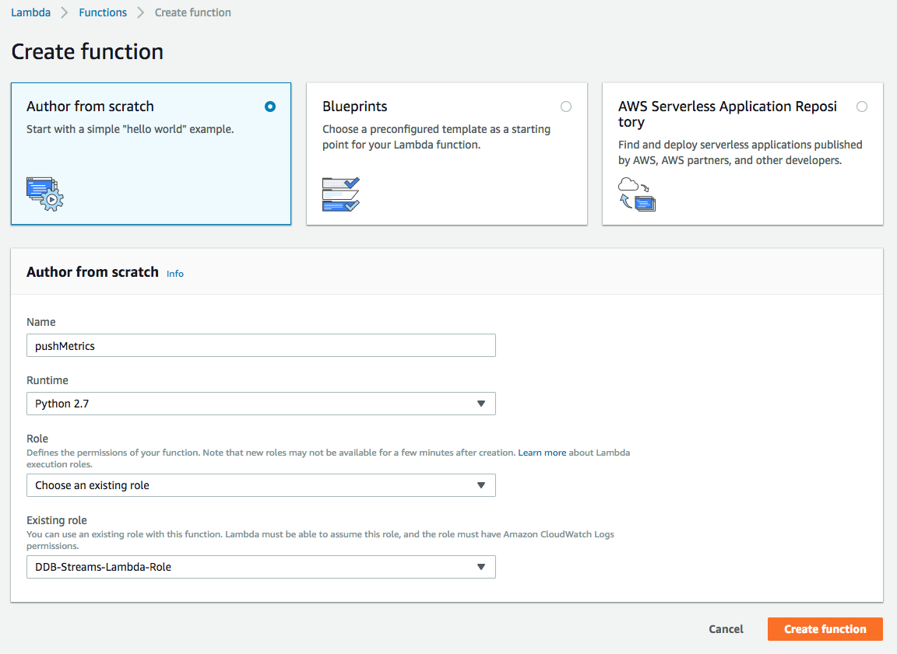

3.  Now, on the Lambda function screen in the console, you'll need to click on **DynamoDB** in the **Designer** underneath **Add triggers**:

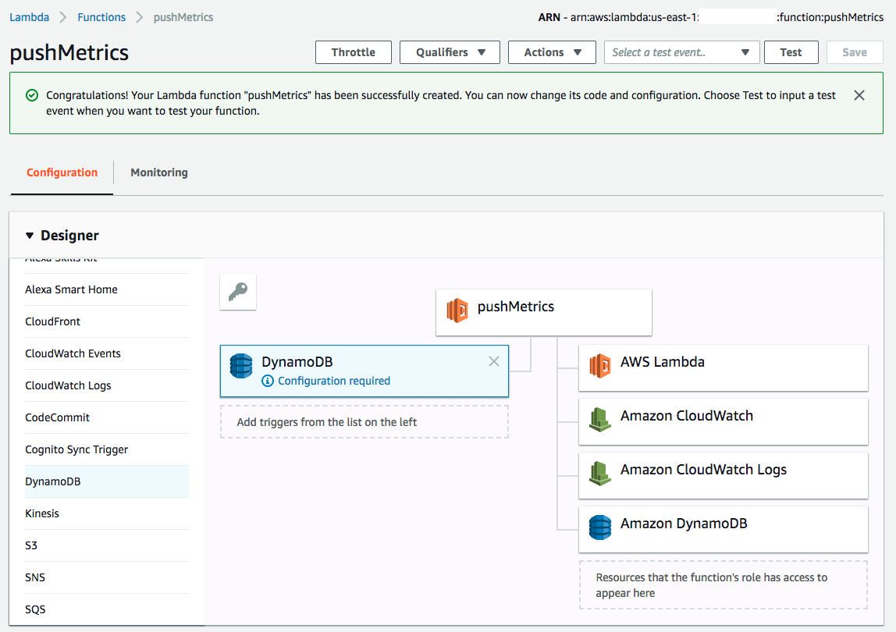

4.  You'll notice that the DynamoDB trigger we just added says "Configuration required" in an informational bubble.  Scroll down to the **Configure triggers** section and select `realtime-analytics-MetricDetails` as the **DynamoDB table**.  Enter `300` for **Batch size**, and select `Trim Horizon` under **Starting Position**.  Click the **Add** button.


5.  Now, scroll down to the **Function code** section, and make sure that `Edit code inline` is selected from the **Code entry type** drop-down menu.  Copy and paste the following Python code into the inline code editing window:

<details>
<summary><strong>Lambda Function Code (expand for code)</strong></summary><p>

```Python
#############################################################################
## cwmetricstream.py - A Lambda function that reads from a DynamoDB stream ##
## and pushes CloudWatch metrics to different event count namespaces.      ##
## Created by Luke Youngblood - lukey@amazon.com                           ##
## ----------------------------------------------------------------------- ##
## Set the following environment variables:                                ##
## REGION = the AWS region you would like to put CloudWatch metric data to ##
## AGENT_NAMESPACE = CloudWatch metric namespace for agent count events    ##
## EVENT_NAMESPACE = CloudWatch metric namespace for standard event counts ##
## REFERRAL_NAMESPACE = CloudWatch metric namespace for referral counts    ##
## PAGEVIEW_NAMESPACE = CloudWatch metric namespace for pageview counts    ##
## ANOMALY_NAMESPACE = CloudWatch metric namespace for anomaly scores      ##
############################################################################# 

import json
import boto3
from os import environ
from datetime import datetime
from collections import defaultdict

def put_cloudwatch_metric(event_name, event_datetime, event_count=1, cwc=boto3.client('cloudwatch', region_name=environ['REGION'])):
    event_name_list = event_name.split(':')
    if event_name_list[0] == 'agent_count':
        namespace=environ['AGENT_NAMESPACE']
        metricname=event_name_list[1]
    elif event_name_list[0] == 'event_count':
        namespace=environ['EVENT_NAMESPACE']
        metricname=event_name_list[1]
    elif event_name_list[0] == 'referral_count':
        namespace=environ['REFERRAL_NAMESPACE']
        metricname=event_name_list[1]
    elif event_name_list[0] == 'top_pages':
        namespace=environ['PAGEVIEW_NAMESPACE']
        metricname=event_name_list[1]
    elif event_name_list[0] == 'event_anomaly':
        namespace=environ['ANOMALY_NAMESPACE']
        metricname=event_name_list[1]
    elif event_name_list[0] == 'visitor_count':
        namespace=environ['EVENT_NAMESPACE'] # visitor_count goes in the standard event count namespace
        metricname=event_name_list[0] # This metric type simply has 'visitor_count' as the metric name
    metricData=[{
            'MetricName': metricname,
            'Timestamp': datetime.strptime(event_datetime, '%Y-%m-%dT%H:%M:%S'),
            'Value': event_count,
            'Unit': 'Count',
            'StorageResolution': 1
        },]
    response = cwc.put_metric_data(Namespace=namespace,MetricData=metricData)

def lambda_handler(event, context):
    events_int = defaultdict(int)
    events_float = defaultdict(float)
    for record in event['Records']:
        for metric in record['dynamodb']['NewImage']['MetricDetails']['L']:
            try: event_timestamp = metric['M']['EVENTTIMESTAMP']['N']
            except Exception as e:
                event_timestamp='NULL'

            if event_timestamp!='NULL':
                timestamp = float(event_timestamp) / 1000
                event_time = datetime.utcfromtimestamp(timestamp).strftime('%Y-%m-%dT%H:%M:%S')

            metric_field = metric['M']['METRICTYPE']['S']
            if metric_field=='agent_count' or metric_field=='event_count' or metric_field=='referral_count' or metric_field=='top_pages':
                if metric['M']['METRICITEM']['S'] == 'null':
                    event_type = metric_field + ':No referrer' # split on : later
                else:
                    event_type = metric_field + ':' + metric['M']['METRICITEM']['S'] # split on : later
                event_value = metric['M']['UNITVALUEINT']['N'] # these metric types all have int values
                events_int[(event_type, event_time)] = int(event_value)
            elif metric_field == 'event_anomaly': # anomalies need to be split on :
                print "Anomaly detected!"
                event_type_list = metric['M']['METRICITEM']['S'].split(':')
                event_type = metric_field + ':' + event_type_list[0] # split on : later
                event_value = metric['M']['UNITVALUEFLOAT']['N'] # anomalies events have float values
                events_float[(event_type, event_time)] = float(event_value)
            elif metric_field == 'visitor_count':
                event_type = metric_field
                event_value = metric['M']['UNITVALUEINT']['N'] # visitor count events have int values
                events_int[(event_type, event_time)] = int(event_value)
            else: event_type = 'NULL'
      
            if event_type!='NULL' and event_timestamp!='NULL':
                if 'NULL' in metric['M']['UNITVALUEFLOAT']:
                    events_int[(event_type, event_time)] = int(event_value)
                else:
                    events_float[(event_type, event_time)] = float(event_value)

    for key,val in events_int.iteritems():
        print "%s, %s = %d" % (key[0], key[1], val)
        put_cloudwatch_metric(key[0], key[1], int(val))
    for key,val in events_float.iteritems():
        print "%s, %s = %f" % (key[0], key[1], val)
        put_cloudwatch_metric(key[0], key[1], float(val))
    return 'Successfully processed {} records.'.format(len(event['Records']))
```
</p></details>

6.  After pasting the code, your inline editor should look like this:


7.  Next, scroll down to the **Environment variables** section, and enter the following environment variables:
  * `AGENT_NAMESPACE` should be `EventAgents`
  * `ANOMALY_NAMESPACE` should be `EventAnomalies`
  * `EVENT_NAMESPACE` should be `EventCounts`
  * `PAGEVIEW_NAMESPACE` should be `PageviewCounts`
  * `REFERRAL_NAMESPACE` should be `ReferralCounts`
  * `REGION` should be the region you're deploying in, either `us-west-2` or `us-east-1`

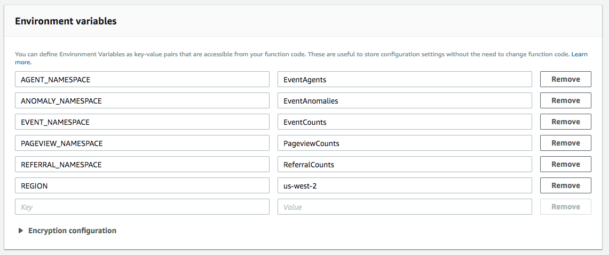

8.  Next, scroll down to the **Basic settings** section, and set **Timeout** to `5` minutes, and leave **Memory** set at `128MB`:

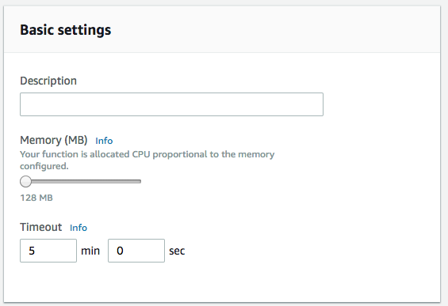

9.  Finally, scroll back up to the top of the Lambda function configuration screen, and click the **Save** button in the top right.

</p></details>

## 4. Visualizing Metrics with CloudWatch Graphs

In this step, we'll create a graph from the CloudWatch metrics that are now being published from DynamoDB Streams by our Lambda function.

<details>
<summary><strong>CloudWatch graph creation (expand for details)</strong></summary><p>

1.  Open the AWS console, then navigate to **Services**, **CloudWatch**, and click on **Metrics** on the left-hand side of the screen:

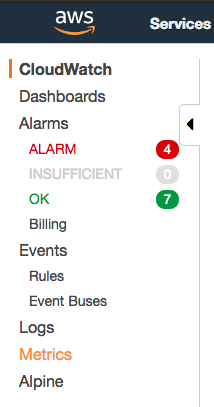

2.  In the bottom half of the next screen, make sure the **All metrics** tab is selected, then click on **EventCounts** in the **Custom Namespaces** section:

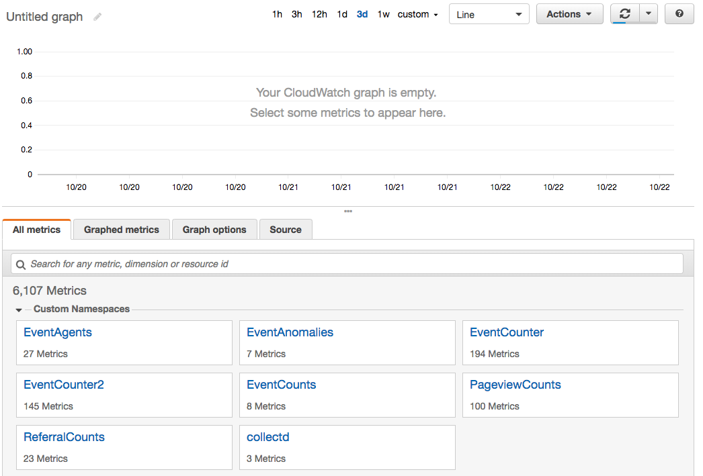

3.  Click on **Metrics with no dimensions** on the next screen:

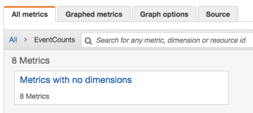

4.  Click the checkbox next to the **click** metric:

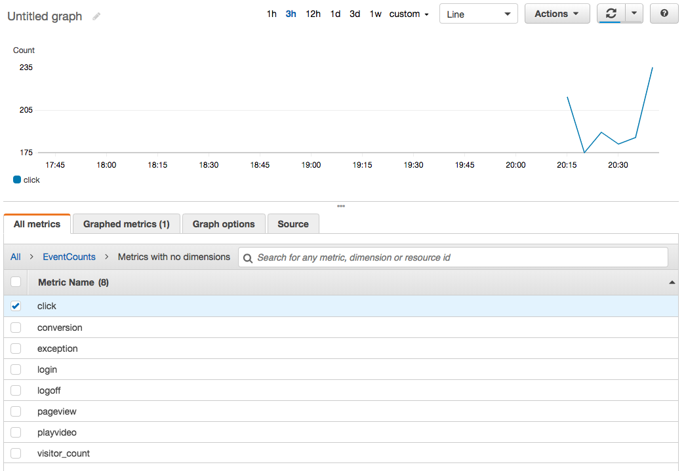

5.  Now click the word **All** in the navigational window directly underneath the **All metrics** tab, to take you back to the complete list of metric namespaces:

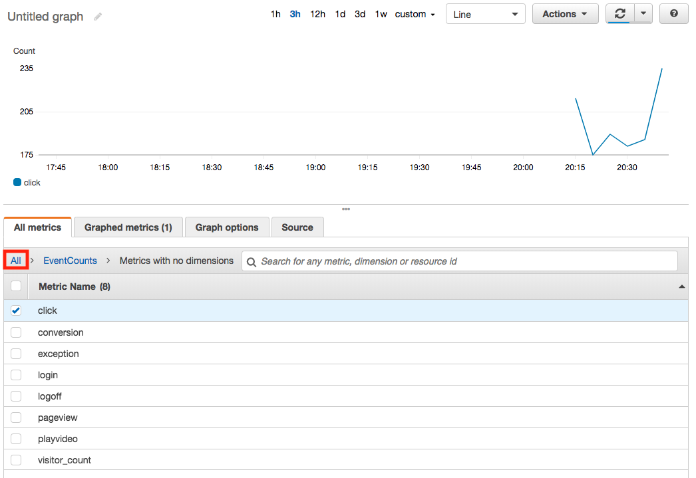

6.  Next, click on the **EventAnomalies** namespace:

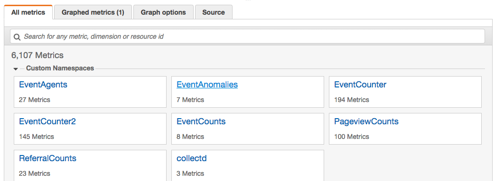

7.  Click on **Metrics with no dimensions** on the next screen:

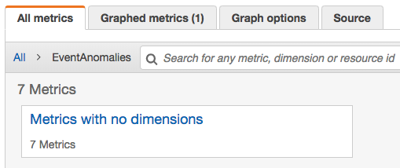

8.  Click the checkbox next to the **click** metric:

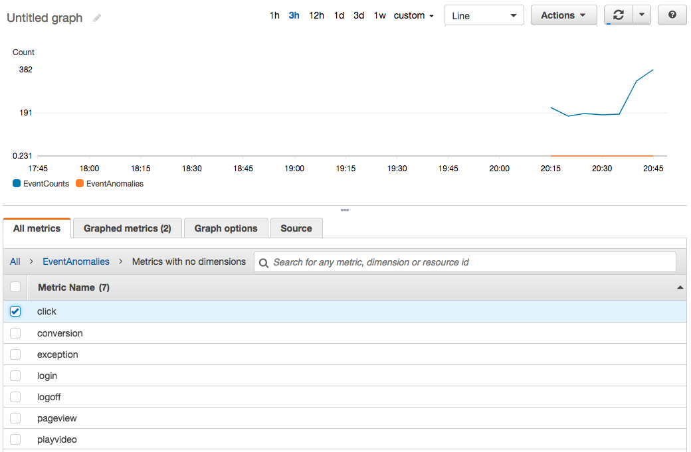

9.  Now, click on the **Graphed metrics (2)** tab:

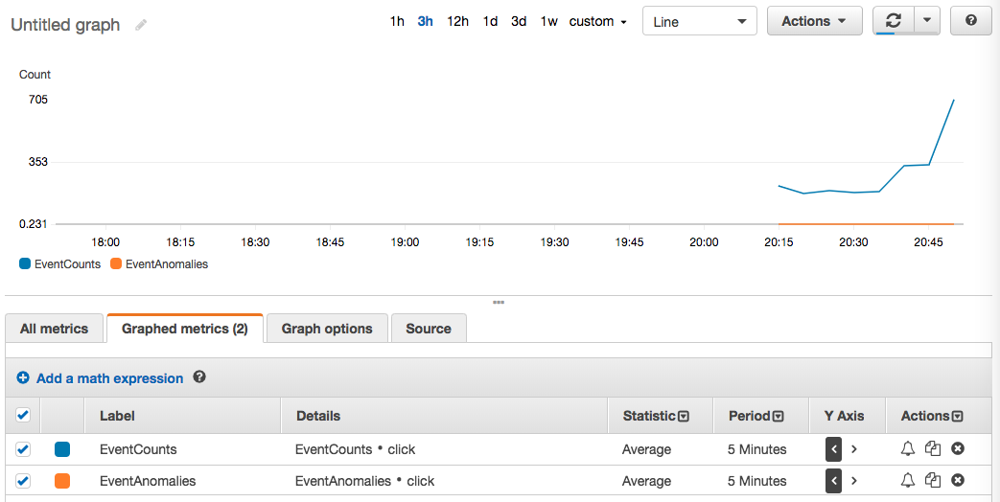

10.  Click the right-arrow underneath the **Y Axis** column in the row for the **EventAnomalies** metric, then click the down-arrow next to the **Period** column, and change the value to *10 seconds*.  When done, your graph should look something like this:

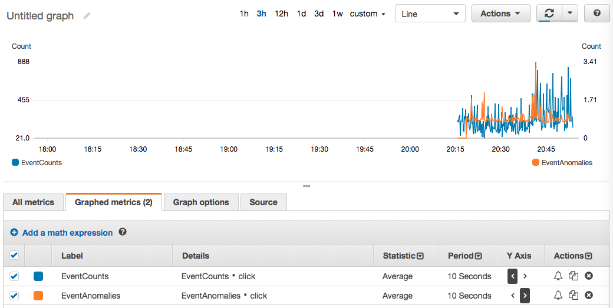

11.  Click the Alarm (bell) icon in the **Actions** column in the row for the **EventAnomalies** metric.  On the **Create Alarm** screen, type in a name, such as `Click event anomaly detected`.  In the **Whenever** section, set it to `Whenever: click is >= 2` (as shown below), and click the **Delete** link in the top-right corner of the default action in the **Actions** section to remove it.  The **Create Alarm** screen should look like this:

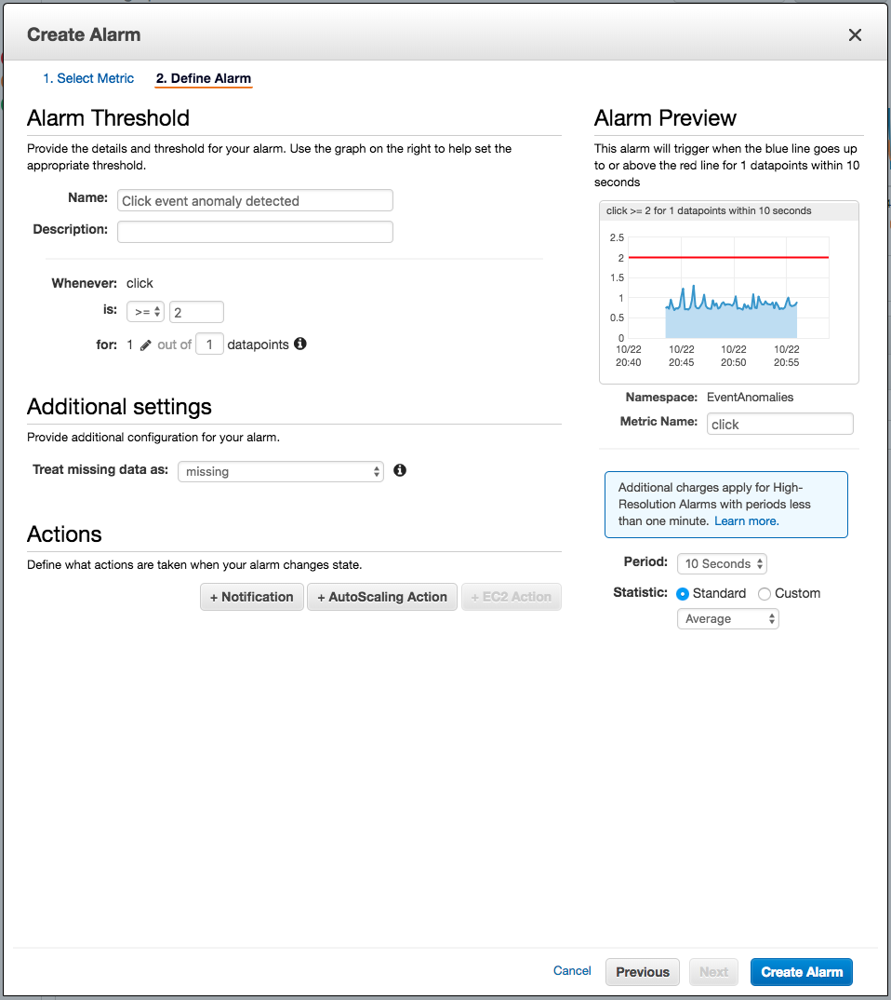

Note: In a real-world environment, you would configure the Alarm to take actions, such as sending a message to a Simple Notification Service topic so that you could be alerted when anomalies occur. 

12.  Click the **Create Alarm** button.

13.  Next, click on the **Graph options** tab and scroll down until you see the **Horizontal annotations** section.  Click the **Add horizontal annotation** link, and fill it in as shown in the screenshot below, clicking the right-arrow in the **Axis** column, filling in `2` in the **Value** column, and typing `Anomaly Threshold` in the **Label** column:

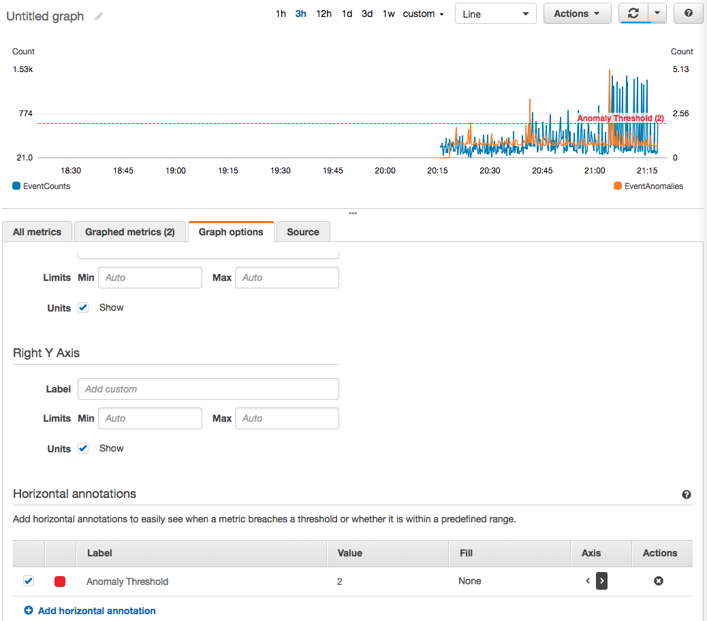

</p></details>

## 4. Visualizing Metrics with CloudWatch Dashboards

Now that you've seen how easy it is to create your own graphs from CloudWatch metrics in the console, you can deploy a pre-created CloudWatch dashboard through CloudFormation.

<details>
<summary><strong>CloudFormation Launch Instructions (expand for details)</strong></summary><p>

1.  Right click the **Launch Stack** link below and "open in new tab"

Region| Launch
------|-----
US West (Oregon) | [](https://console.aws.amazon.com/cloudformation/home?region=us-west-2#/stacks/new?stackName=realtime-analytics-workshop&templateURL=https://s3-us-west-2.amazonaws.com/realtime-analytics-workshop/1-frontend-module-start.yaml)
US West (N. Virginia) | [](https://console.aws.amazon.com/cloudformation/home?region=us-east-1#/stacks/new?stackName=realtime-analytics-workshop&templateURL=https://s3-us-west-2.amazonaws.com/realtime-analytics-workshop/1-frontend-module-start.yaml)

2.  Give the stack a name, such as `cloudwatch-dashboard`, and click **Next** until the stack launches.

3.  Navigate in the console to **Services**, **CloudWatch**, then click **Dashboards** on the left side of the screen, and select the dashboard that was just created to view it:

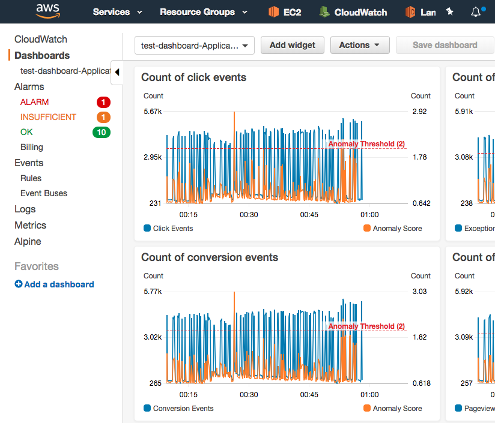

Congratulations!  You are now finished with module 3.

</p></details>

### Start next module

Module 4: [Adding Custom Metrics and Extending the Solution](../module-4/README.md)

## License Summary

Copyright 2018 Amazon.com, Inc. or its affiliates. All Rights Reserved.

This sample code is made available under a modified MIT license. See the LICENSE file.

[Back to the main workshop page](../README.md)
